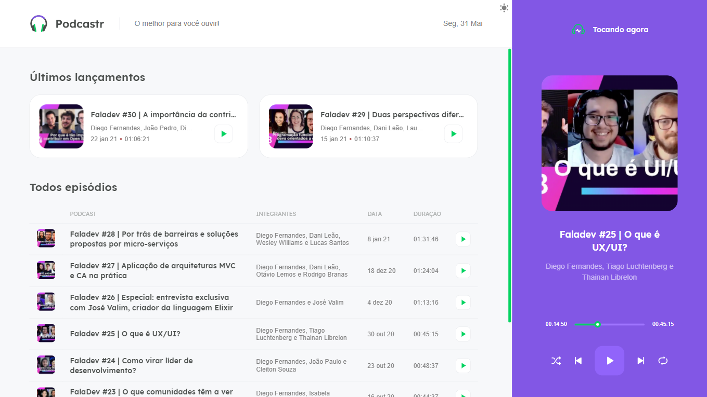
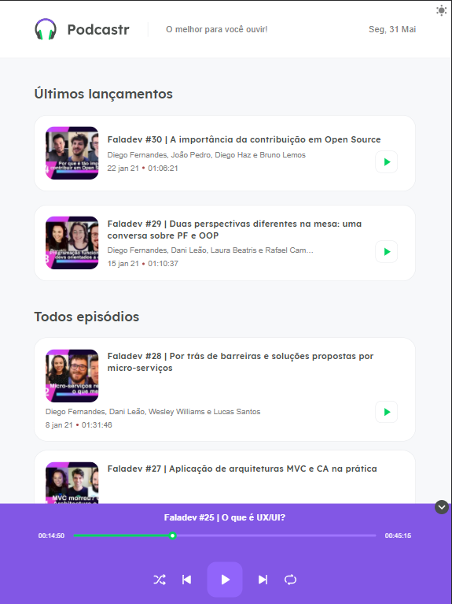
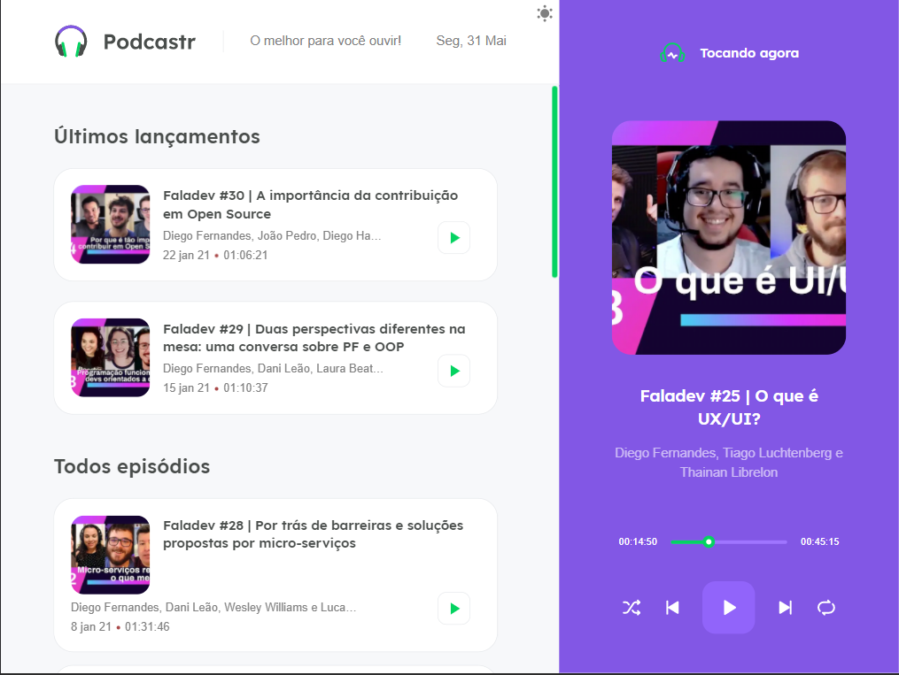
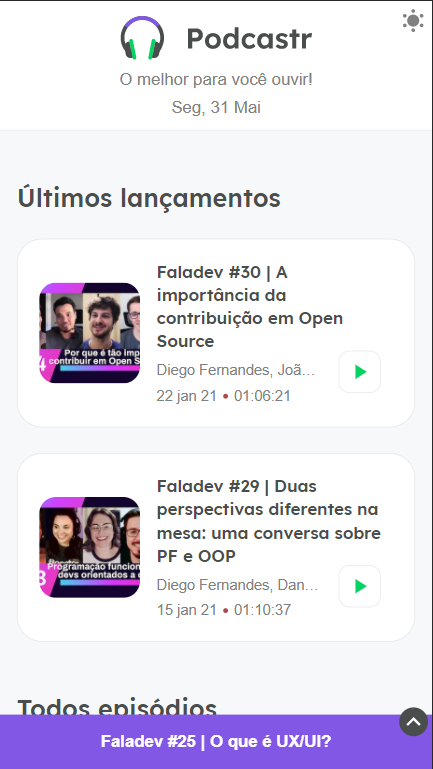

<h1 align="center">Podcastr</h1>

Podcastr is a website designed to broadcast a particular podcast.

**Table of Contents**

- [Overview](#Overview)
    - [About](#About)
    - [Demonstration](#Demonstration)
- [Technologies](#Technologies)
    - [Requirements](#Requirements)
    - [How to run](#How-to-run)
- [Installation](#Installation)
- [Author](#Author)
- [License](#License)

# Overview

## About
The Podcastr is a website based on a project from @Rocketseat 's NLW 5, where you can listen to the episodes of a specific podcast.

It is responsive and adaptive, so you can access it on your computer, tablet or smartphone.

In addition, it is possible to switch between light and dark themes.

## Demonstration
**Desktop/Laptop**

**Tablet**

**Smartphone**

**Theme toggle**

# Technologies
The app was built with the following technologies:

- **[React.js](https://reactjs.org/)**
- **[Next.js](https://nextjs.org/)**
- **[Node.js](https://nodejs.org/en/)**

# Installation
## Requirements
Before getting started, you need have installed Node.js.
A code editor, such as Visual Studio Code, is also required.
In this project, it was used the package manager Yarn, but you can also use npm.

## How to run

**Clone this repository:**

``git clone https://github.com/okalil/podcastrnext.git``

**Access the project's folder**

``cd podcastrnext``

**Install the dependencies:**

`yarn install` or `npm install`

**Run the app in development mode:**

`yarn dev` or `npm run dev`

**Run the fake server:**

`yarn server` or `npm server`

Done! The app will be running on http://localhost:3000/.

# Author

**Andrew Kalil**

It was made with dedication by Andrew Kalil!

# License
This project is licensed under the MIT License - look the LICENSE file for more details.
